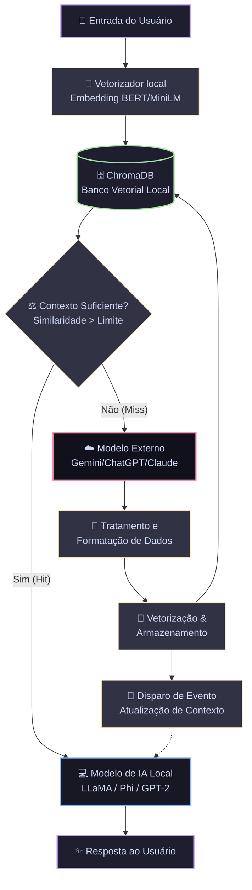

# 🧠 MIMIC AI — Relatório de Auditoria Arquitetural e Plano de Implementação

> [!IMPORTANT]
> **Status do Repositório:** O código atual do projeto consiste estritamente em **esqueletos vazios (boilerplates de templates padrão)**. Não há conexões entre os projetos .NET no backend, nenhuma dependência de Inteligência Artificial ou Banco de Dados Vetorial instalada, e o frontend é o template básico do Vite + TypeScript Vanilla com um contador de cliques.
> 
> Este documento analisa detalhadamente a proposta inovadora do **MIMIC AI** e estabelece o mapeamento completo e o plano de ação técnico necessário para transformar os esqueletos atuais em uma arquitetura de IA local e híbrida de alta performance.

---

## 1. Análise Criteriosa da Proposta (MIMIC AI)

A proposta do **MIMIC AI** aborda um dos maiores gargalos das aplicações modernas de inteligência artificial: **o custo financeiro e a dependência de infraestrutura centralizada (APIs de terceiros)**. 

### O Conceito Central
O sistema propõe uma **Arquitetura de Cache Semântico Adaptativo e Roteamento Híbrido** com **Compilação de Memória em Tempo de Execução**. Ele funciona como um amortecedor de custos que aprende com cada chamada externa, consolidando um banco de dados local que gradualmente torna o modelo local autônomo.

### Análise do Fluxo Operacional Proposto



### Detalhes Técnicos Críticos Identificados na Proposta

1. **A Camada de Vetorização (Embedding Agent):**
   - **Proposta:** Utilizar BERT para vetorizar a entrada do usuário.
   - **Análise Técnico-Prática:** Modelos BERT tradicionais são excelentes para tarefas como classificação, mas para embeddings voltados à busca semântica e RAG, modelos especializados do tipo **Sentence-Transformers (como `all-MiniLM-L6-v2`)** são muito mais eficientes, compactos e geram vetores otimizados para similaridade de cosseno (Cosine Similarity). Podem rodar localmente no backend em C# via ONNX Runtime ou através de um microsserviço Python/Ollama com consumo mínimo de recursos.

2. **Avaliação de Suficiência (O Limiar Dinâmico / Decision Threshold):**
   - **Desafio:** Como decidir com precisão se o contexto local recuperado é suficiente para responder ao usuário?
   - **Solução Arquitetural:** Devemos implementar um **Fator de Similaridade de Cosseno Mínimo (Threshold)** (ex: $> 0.78$ como valor de corte padrão). Se a maior pontuação de similaridade de cosseno retornada pela busca semântica no ChromaDB for menor que este limiar, o sistema assume automaticamente que o conhecimento local atual é insuficiente (*Cache Miss*) e escalona para a API externa. Caso contrário (*Cache Hit*), o contexto é injetado no prompt do modelo local.

3. **Ciclo de Feedback & Ingestão Assíncrona:**
   - **Desafio:** Quando o modelo externo responde, precisamos capturar o par `Pergunta-Resposta` e inseri-lo no banco sem que isso gere latência bloqueante para o usuário final.
   - **Mecanismo:** A resposta externa é capturada, limpa (remoção de metadados redundantes ou tokens especiais) e enviada para uma fila de processamento em background (utilizando `System.Threading.Channels` do C#). O `WorkerService` monitora essa fila assincronamente: ele vetoriza a interação e a armazena no ChromaDB com metadados estruturados (tags, timestamps, IDs). Após o salvamento, um evento de barramento interno avisa a camada de inferência que novos dados de contexto estão disponíveis, permitindo que futuras consultas semelhantes sejam resolvidas localmente.

---

## 2. Auditoria Detalhada do Código Atual (MimicAI)

Analisamos minuciosamente a estrutura de arquivos no diretório `i:\MimicAI`. Abaixo está o mapeamento exato da situação do projeto:

### 2.1. Estrutura de Diretórios
```text
i:\MimicAI\
├── back-end\
│   ├── Appi\ (Web API ASP.NET Core)
│   ├── Controllers\ (Biblioteca de Classes)
│   ├── Database\ (Biblioteca de Classes)
│   ├── Repositorys\ (Biblioteca de Classes)
│   ├── Services\ (Biblioteca de Classes)
│   ├── WorkerService\ (Serviço de Background do .NET)
│   └── back-end.sln (Arquivo de Solução do Visual Studio)
└── front-end\
    ├── src\ (Código-fonte TypeScript Vanilla)
    ├── package.json (Dependências do Node)
    ├── tsconfig.json (Configuração do TypeScript)
    └── index.html (Página HTML Principal)
```

---

### 2.2. Diagnóstico do Backend (.NET Core)

Cada um dos 6 projetos dentro da pasta `back-end` foi auditado e analisado:

| Projeto | Arquivos Principais | Dependências Atuais (`PackageReference`) | Estado de Implementação |
| :--- | :--- | :--- | :--- |
| [Appi](file:///i:/MimicAI/back-end/Appi) | [Program.cs](file:///i:/MimicAI/back-end/Appi/Program.cs), `appsettings.json` | `Microsoft.AspNetCore.OpenApi` (8.0.24)<br>`Swashbuckle.AspNetCore` (6.6.2) | **Esqueleto Inicial.** Contém apenas o endpoint padrão `/weatherforecast` gerado pelo template de Minimal API do .NET 8. Nenhuma rota de chat ou IA existe. |
| [Controllers](file:///i:/MimicAI/back-end/Controllers) | [Class1.cs](file:///i:/MimicAI/back-end/Controllers/Class1.cs) | *Nenhuma* | **Vazio.** Contém apenas a classe padrão de template `Class1`. Nenhuma referência a outros projetos da solução. |
| [Database](file:///i:/MimicAI/back-end/Database) | [Class1.cs](file:///i:/MimicAI/back-end/Database/Class1.cs) | *Nenhuma* | **Vazio.** Sem conexões com banco de dados relacional (SQLite/Postgres) ou vetorial (ChromaDB). |
| [Repositorys](file:///i:/MimicAI/back-end/Repositorys) | [Class1.cs](file:///i:/MimicAI/back-end/Repositorys/Class1.cs) | *Nenhuma* | **Vazio.** Nenhuma abstração de acesso a dados ou repositório de vetores implementada. |
| [Services](file:///i:/MimicAI/back-end/Services) | [Class1.cs](file:///i:/MimicAI/back-end/Services/Class1.cs) | *Nenhuma* | **Vazio.** Sem lógica para orquestração de chamadas de LLM, sem embeddings, sem conexão com APIs remotas (Gemini/OpenAI). |
| [WorkerService](file:///i:/MimicAI/back-end/WorkerService) | [Worker.cs](file:///i:/MimicAI/back-end/WorkerService/Worker.cs), [Program.cs](file:///i:/MimicAI/back-end/WorkerService/Program.cs) | `Microsoft.Extensions.Hosting` (8.0.1) | **Básico.** Contém um serviço em background que apenas registra um log com o horário atual a cada 1 segundo. Nenhuma lógica de fila de processamento ou eventos de ingestão de IA. |

> [!WARNING]
> **Ausência de Referências de Projeto (.csproj):**
> Os projetos da solução [back-end.sln](file:///i:/MimicAI/back-end/back-end.sln) estão completamente **isolados**. O projeto principal `Appi` não referencia `Services` ou `Controllers`, e `Services` não possui ligações com `Database` ou `Repositorys`. Para que o fluxo de IA funcione, precisamos estabelecer as referências corretas no formato de Arquitetura Limpa (Clean Architecture / Onion Architecture).

---

### 2.3. Diagnóstico do Frontend (Vite + TypeScript Vanilla)

O frontend foi desenvolvido usando o template padrão do Vite com **TypeScript puro e Vanilla CSS**.

- **[package.json](file:///i:/MimicAI/front-end/package.json)**:
  ```json
  "devDependencies": {
    "typescript": "~6.0.2",
    "vite": "^8.0.10"
  }
  ```
- **[src/main.ts](file:///i:/MimicAI/front-end/src/main.ts)**: Inicializa um layout estático padrão do Vite com os logos do TypeScript e Vite, contendo apenas um botão de contador ([counter.ts](file:///i:/MimicAI/front-end/src/counter.ts)) que soma cliques localmente na memória do navegador.
- **[src/style.css](file:///i:/MimicAI/front-end/src/style.css)**: Folha de estilos padrão do template do Vite para estilização centralizada e layouts simples.
- **Diagnóstico de UI:** Não há nenhuma interface de chat, nem visualizadores de logs, conexões de API com o backend, ou gráficos estatísticos para demonstrar o comportamento dinâmico do sistema.

---

## 3. Plano de Ação & Stack Recomendada para o Desenvolvimento

Para sair deste estado inicial de templates vazios e entregar um ecossistema robusto, premium e altamente funcional, propomos as seguintes tecnologias e integrações:

### 3.1. Stack Tecnológica Recomendada

#### Backend (.NET 8 Core)
1. **Execução Local de IA (LLM Local):**
   - **Opção Recomendada:** Conectar o backend à API local do **Ollama** utilizando o pacote `OllamaSharp` ou `Microsoft.SemanticKernel.Connectors.Ollama`. Isso nos permite rodar modelos avançados como `llama3:8b`, `phi3:mini` ou `gemma2` na máquina local de forma otimizada para CPU ou GPU dedicada, mantendo o processo do C# leve e rápido.
2. **Integração com LLMs Externos:**
   - Utilizar as bibliotecas oficiais para chamadas das APIs externas ou usar o **Semantic Kernel** da Microsoft (`Microsoft.SemanticKernel`), que simplifica o gerenciamento de prompts e permite trocar facilmente entre provedores como OpenAI (ChatGPT), Google (Gemini) ou Anthropic (Claude) por meio de interfaces unificadas.
3. **Embeddings & Similaridade Semântica:**
   - Adicionar o pacote `Microsoft.ML.OnnxRuntime` e `FastBert` para gerar embeddings locais em milissegundos utilizando o modelo ultra leve `all-MiniLM-L6-v2` (de apenas 30MB), mantendo o processo de vetorização 100% privado e local, sem custos de API.
4. **Banco de Dados Vetorial:**
   - Usar o cliente oficial `ChromaDB.Client` para se comunicar com um container ChromaDB local, ou utilizar **SQLite-vec** (extensão leve de vetores para o SQLite) para criar uma solução totalmente embarcada em um único arquivo `.db`.
5. **Eventos e Processamento Assíncrono:**
   - Utilizar `System.Threading.Channels` para passar dados entre a API e o `WorkerService` com alta vazão e concorrência controlada.

#### Frontend (Vanilla HTML, CSS & TypeScript)
Como o projeto está estruturado em Vanilla TS, podemos criar uma aplicação de página única (SPA) ultra rápida, reativa e visualmente exuberante sem o overhead de frameworks pesados:
- **Design System Premium**: Cores ricas em gradientes de roxo profundo (`#1e1e2e`), cinzas azulados, efeitos de desfoque de fundo (Glassmorphism), e fontes modernas (Inter / Outfit).
- **Dashboard Estatístico SVG/Canvas**: Renderização manual de gráficos altamente otimizados mostrando a taxa de acerto do cache (*Local Hit Rate*) e a curva de redução exponencial de custos de API em tempo real.
- **Console de Roteamento**: Área que exibe o fluxo em tempo real de cada prompt do usuário, detalhando a pontuação de similaridade semântica de cosseno obtida, se houve hit local ou se escalou para o Gemini, o tempo de latência de cada etapa, e o novo nó gravado no banco vetorial.

---

## 4. Plano de Implementação Estruturado (Passo a Passo)

Propomos o seguinte roteiro modular de desenvolvimento para que cada fase adicione valor testável e funcional:

### Fase 1: Arquitetura de Referências e Conectividade Básica
*   **Ação:** Configurar os arquivos `.csproj` para estabelecer as conexões entre os projetos .NET.
*   **Ação:** Criar as rotas de API no projeto `Appi` para `/api/chat` (receber mensagens) e `/api/metrics` (retornar dados de economia).
*   **Ação:** Implementar o cliente HTTP para a API remota do Gemini ou OpenAI, tornando o fluxo básico de fallback funcional.

### Fase 2: Camada Vetorial & Similaridade de Cosseno (Local Memory)
*   **Ação:** Instalar e configurar a infraestrutura de vetores (ChromaDB ou SQLite-vec no projeto `Database` / `Repositorys`).
*   **Ação:** Implementar a geração local de embeddings usando `all-MiniLM-L6-v2` em C#, garantindo velocidade extrema para indexação e consultas sem custos de rede.
*   **Ação:** Implementar a lógica de busca semântica e determinação de corte (Threshold), comparando a similaridade de cada pergunta nova com as interações históricas.

### Fase 3: Roteador de IA Híbrido & Inferência Local
*   **Ação:** Conectar o backend ao Ollama para executar o modelo local (ex: `Llama-3` ou `Phi-3`).
*   **Ação:** Codificar o algoritmo de decisão inteligente no orquestrador de IA do projeto `Services`:
    *   Se similaridade semântica for $\ge T$: Recupera a resposta histórica do banco vetorial, injeta como contexto para o modelo local refinar/sintetizar e devolve ao usuário (*Local Resolution*).
    *   Se similaridade semântica for $< T$: Envia a pergunta para a API do Gemini/OpenAI (*Escalation*).

### Fase 4: Loop de Feedback e Worker Assíncrono
*   **Ação:** Configurar um `Channel` thread-safe in-memory para transporte de eventos.
*   **Ação:** Modificar o `WorkerService` para ler desse canal assincronamente. Sempre que a API externa fornecer uma resposta, a interação (`Pergunta + Resposta Externa`) é enviada ao canal.
*   **Ação:** O Worker gera os embeddings, insere o registro no ChromaDB de forma silenciosa e atualiza as métricas locais de acúmulo de conhecimento.

### Fase 5: Dashboard e Chat de Alta Fidelidade (Frontend)
*   **Ação:** Substituir o template básico do Vite por uma interface premium de página dividida em duas áreas:
    *   **Lado Esquerdo: Analytics Dashboard** — Gráficos interativos da taxa de autonomia (%), custo acumulado de APIs tradicionais vs. MIMIC AI (economia total), tamanho da base vetorial local e monitor de latência de rede.
    *   **Lado Direito: Terminal de Chat Inteligente** — Chat interativo com streaming de caracteres, identificação clara de quem respondeu a mensagem (Badge neon `LOCAL SYNTHESIS` ou `EXTERNAL ESCALATION`) e detalhamento do log de roteamento semântico no próprio balão da conversa.

---

> [!TIP]
> **Próximo Passo Recomendado:** 
> Deseja que iniciemos o desenvolvimento configurando as **referências de projeto, pacotes NuGet e a fundação de rotas da API no Backend** (.NET), ou prefere focar na estruturação do **layout e visualizações premium do Frontend** (Vite + TypeScript Vanilla) para termos o painel interativo funcional primeiro?
