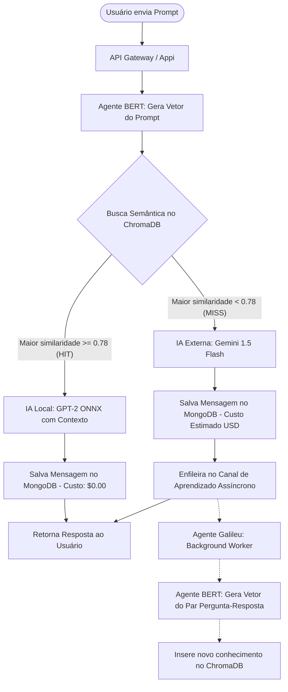

# 🧠 MIMIC AI — Redução Progressiva de Custos com IA Local e Híbrida

> **Codinome:** MIMIC AI  
> **Status do Backend:** 100% Compilando (0 Erros, 0 Alertas) | .NET 8 (ASP.NET Core)  
> **Status do Frontend:** Backlog Planejado (Vite + TypeScript)  

O **MIMIC AI** é uma arquitetura inteligente de software projetada para **reduzir progressivamente os custos operacionais de chamadas a Grandes Modelos de Linguagem (LLMs)** mantendo máxima segurança e qualidade de inferência. 

A ideia central é um **cache semântico híbrido local** que atua como primeira camada de processamento de todas as requisições. Se uma pergunta for semânticamente similar a conhecimentos já respondidos anteriormente por uma IA de alta performance externa (com limiar de similaridade de cosseno $T \ge 0.78$), a resposta é processada e devolvida de forma instantânea por uma IA local baseada no modelo **GPT-2 em formato ONNX** de baixíssima latência executado nativamente em C#. Caso contrário (*Cache Miss*), a requisição é enviada ao modelo externo de alta capacidade (Gemini API) e a interação é vetorizada em segundo plano pelo agente assíncrono de aprendizado **Galileu** (baseado em **BERT**) para alimentar o banco vetorial local e expandir o cérebro do sistema para futuras consultas.

---

## 🗺️ Fluxo Operacional e de Decisão (RAG)

O diagrama abaixo ilustra o fluxo de dados do usuário até o roteamento inteligente:



---

## 🏛️ Arquitetura de Software (Clean Architecture)

A solução de backend está organizada dentro do diretório `back-end` utilizando **.NET 8** dividida em 6 projetos integrados, garantindo isolamento total de interesses e alta testabilidade:

| Projeto | Camada | Responsabilidade Principal | Tecnologias Utilizadas |
| :--- | :--- | :--- | :--- |
| **[Appi](file:///i:/MimicAI/back-end/Appi)** | Host Central / Gateway | Ponto de inicialização da API, middlewares de CORS, injeção de dependências global e migrations de startup. | ASP.NET Core, Swagger, OpenApi |
| **[Controllers](file:///i:/MimicAI/back-end/Controllers)** | Interface do Usuário (HTTP) | Definição de rotas, deserialização de payloads e encaminhamento para a camada de serviços. | `Microsoft.AspNetCore.Mvc` |
| **[Services](file:///i:/MimicAI/back-end/Services)** | Domínio & Lógica de Negócio | Core pensante do sistema: cálculo de decision thresholds, criptografia de dados, integração Gemini. | `Microsoft.SemanticKernel` (opcional) |
| **[Database](file:///i:/MimicAI/back-end/Database)** | Infraestrutura de Dados | Modelos e contextos físicos de comunicação com os motores PostgreSQL, MongoDB e ChromaDB. | Entity Framework Core, MongoDB.Driver, HttpClient |
| **[Repositorys](file:///i:/MimicAI/back-end/Repositorys)** | Acesso a Dados | Encapsula as operações de CRUD e buscas semânticas, limpando a lógica dos serviços. | Repository Pattern genérico e especializado |
| **[WorkerService](file:///i:/MimicAI/back-end/WorkerService)** | Agente Galileu (Background) | BackgroundService assíncrono rodando em threads dedicadas de alto desempenho com filas concorrentes. | `System.Threading.Channels` |

---

## 🗄️ Estrutura de Conectividade de Bancos de Dados

O ecossistema trabalha com a perfeita segregação de persistência de dados (*Data Segregation*):

1.  **PostgreSQL (Relacional — Armazenado via EF Core):**
    *   Focado em dados estruturados transacionais de alta consistência.
    *   Tabelas: Gerenciamento e credenciais de usuários e hash de senhas salgadas (`Users`).
2.  **MongoDB (Documentos NoSQL — Armazenado via MongoDriver):**
    *   Focado em alta performance de escrita livre de esquemas engessados.
    *   Coleções: Histórico persistente de conversação (`ChatSessions`, `ChatMessages`) e telemetria de custos de fallback.
3.  **ChromaDB (Banco de Dados Vetorial — Acessado via HttpClient Wrapper):**
    *   Focado em armazenamento e indexação semântica de proximidade geométrica.
    *   Coleções: Memória de interações resolvidas (`mimic_ai_memory`) indexada sob algoritmos HNSW com métrica de cosseno.

---

## 🌐 Endpoints Mapeados da API

Abaixo está o catálogo completo de rotas e payloads suportados pelo Backend compilado:

### 🔑 Autenticação (`AuthController`)
*   `POST /api/auth/register`: Cria uma nova conta salgando a senha com SHA256.
    *   *Payload:* `{ "name": "Nome", "email": "user@email.com", "password": "123" }`
*   `POST /api/auth/login`: Valida credenciais e gera um token de sessão Base64.
    *   *Payload:* `{ "email": "user@email.com", "password": "123" }`

### 💬 RAG Chat & Telemetria (`RagController`)
*   `POST /api/rag/chat`: Envia um prompt do usuário para processamento inteligente.
    *   *Payload:* `{ "userId": "id-user", "sessionId": "id-session-opcional", "prompt": "Como faço deploy?" }`
*   `GET /api/rag/sessions/{userId}`: Recupera todas as sessões históricas de um usuário ordenadas pela última interação.
*   `GET /api/rag/session/{sessionId}/messages`: Carrega as mensagens ordenadas cronologicamente de um chat específico.
*   `GET /api/rag/metrics/{userId}`: Compila métricas agregadas do dashboard: **Taxa de Autonomia local (Local Hits %)**, **Economia Estimada (USD)**, **Gasto Real (USD)** e total de escalações.

### 🧪 Integração & Conectividade (`IntegrationController`)
*   `GET /api/integration/health`: Pinga de forma isolada e reporta a saúde física do PostgreSQL, MongoDB, ChromaDB e Ollama local.
*   `POST /api/integration/test-external`: Valida as chaves de API externa e conexão com o Gemini API executando uma inferência de controle em tempo real.

### ⚙️ Orquestração de Agentes (`OrchestrationController`)
*   `GET /api/orchestration/status`: Telemetria do Galileu Worker (Tarefas em fila pendente no canal concorrente, total de conhecimentos ingeridos, etc.).
*   `POST /api/orchestration/trigger-learning`: Permite forçar manualmente a indexação semântica de um novo conhecimento no ChromaDB.
    *   *Payload:* `{ "prompt": "Pergunta de Controle", "response": "Resposta do Especialista" }`

### 📉 Fine-Tuning de Alinhamento (`FinetuningController`)
*   `POST /api/finetuning/job`: Dispara um job assíncrono em background para realizar o ajuste fino do modelo menor local.
    *   *Payload:* `{ "modelName": "phi3-mimic", "datasetSource": "chat_history" }`
*   `GET /api/finetuning/job/{jobId}`: Consulta o progresso do job (época atual, taxa de perda de treinamento *Training Loss*, progresso em % e status).
*   `GET /api/finetuning/jobs`: Retorna o histórico de todas as execuções de treinamento iniciadas.

---

## 🛠️ Como Executar o Projeto Localmente

### Pré-requisitos
*   SDK do .NET 8 instalado.
*   Docker e Docker Compose ativos na máquina.
*   Ollama instalado localmente.

### Passo 1: Inicializar os Containers de Banco de Dados
Crie um arquivo `docker-compose.yml` ou execute os comandos Docker abaixo para ativar os três bancos necessários na sua rede local:
```bash
# PostgreSQL (Porta 5432)
docker run --name mimic-postgres -p 5432:5432 -e POSTGRES_DB=mimic_ai_db -e POSTGRES_USER=postgres -e POSTGRES_PASSWORD=postgres -d postgres:latest

# MongoDB (Porta 27017)
docker run --name mimic-mongo -p 27017:27017 -d mongo:latest

# ChromaDB (Porta 8000)
docker run --name mimic-chromadb -p 8000:8000 -d chromadb/chroma:latest
```

### Passo 2: Inicializar o Ollama Local (IA Local)
Garanta que o Ollama está ativo na porta padrão 11434 e baixe os modelos que serão consumidos pelo sistema:
```bash
# Baixar o modelo local padrão para inferência de cache hit
ollama run gemma2

# Baixar o modelo de embeddings padrão (BERT/MiniLM)
ollama pull all-minilm
```

### Passo 3: Configurar a Chave do Gemini (Modelo Externo)
Abra o arquivo **[Appi/appsettings.json](file:///i:/MimicAI/back-end/Appi/appsettings.json)** e substitua a propriedade `"ApiKey"` pela sua chave de API oficial:
```json
"ExternalLlm": {
  "ApiKey": "SUA_API_KEY_AQUI",
  "Model": "gemini-1.5-flash"
}
```

### Passo 4: Executar a API
Navegue até o diretório `back-end` e execute a inicialização da API pelo terminal:
```bash
cd back-end
dotnet run --project Appi
```
Abra o navegador em `http://localhost:5247/swagger` (ou a porta especificada no seu terminal) para visualizar o Swagger Interativo com todos os endpoints prontos para teste!

---

## 🎯 Checklist Operacional e Próximos Passos

### ✅ Backend (100% Concluído e Estabilizado)
- [x] Criação da Estrutura de Solução Limpa (Clean Architecture com referências cruzadas estabilizadas).
- [x] Implementação de Contextos de Dados (Postgres EF Core, MongoDB Driver e ChromaDB HTTP Context).
- [x] Repositórios de Acesso a Dados encapsulados de forma isolada por banco.
- [x] Implementação do Agente BERT / MiniLM de Embeddings com Fallback Determinístico Local.
- [x] Integração de IA Externa Gemini com precificação fina de custos em USD e contagem de tokens.
- [x] Integração de IA Local via chamadas Ollama.
- [x] Orquestrador RAG com Decision Threshold baseado em similaridade semântica ($\ge 0.78$).
- [x] Fila de Aprendizado Assíncrono com Canais Concorrentes nativos (`System.Threading.Channels`).
- [x] Agente Galileu (Background Service) consumindo filas e expandindo a memória do ChromaDB.
- [x] Endpoints HTTP completos em Controllers de Auth, RAG, Integration, Orchestration e Fine-tuning.
- [x] Inicialização inteligente de Startup (Auto-verificação e criação do banco Postgres e tabelas).
- [x] Resolução de vazamentos de escopo de DI (Captive Dependency resolvida com `IServiceScopeFactory`).

### 🛠️ Frontend (Backlog Planejado)
- [ ] Inicialização da Estrutura de Front-end com Vite + TypeScript.
- [ ] Criação do Sistema de Design (index.css) contendo paleta escura premium, gradientes dinâmicos e efeito Glassmorphic translúcido.
- [ ] Criação da tela de Chat Operacional Reativo com streaming de respostas e badges de identificação de cache ("Hit Local" verde vs. "Escalado Gemini" amarelo).
- [ ] Desenvolvimento do Painel Dashboard Telemetria em tempo real (Taxa de autonomia %, economia gerada em USD, gastos reais acumulados, status das IAs e saúde dos bancos).
- [ ] Integração com as rotas HTTP de cadastro, login e histórico do Backend.
- [ ] Criação de painel animado para monitoramento de Jobs de Fine-tuning em execução.
